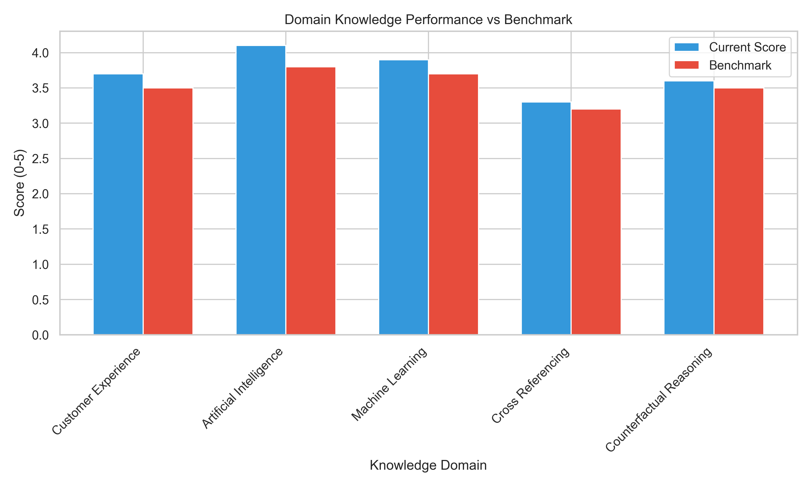
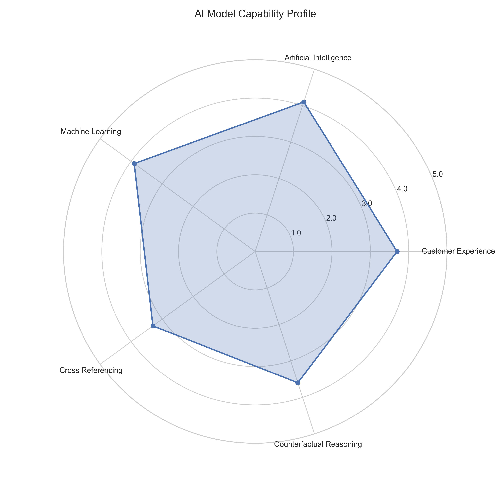
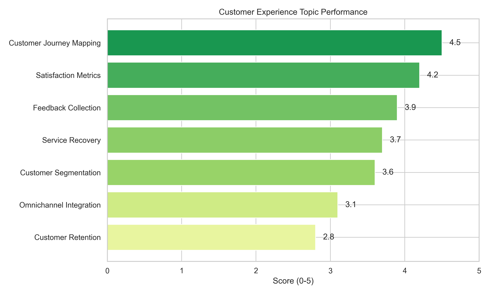
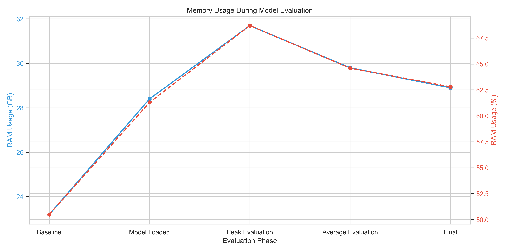

# Model Evaluation Visualization Guide

This guide explains how to visualize the results from the AI model evaluation framework using the built-in visualization tools.

## Overview

The visualization system transforms evaluation metrics into insightful charts and graphs, making it easier to understand model performance across different domains. The system generates:

1. **Domain score comparisons** - Bar charts comparing performance across knowledge domains
2. **Capability radar charts** - Radar visualization of model capabilities
3. **Topic performance breakdowns** - Detailed charts of performance on specific topics
4. **Memory usage tracking** - Line charts showing memory utilization
5. **Comprehensive HTML reports** - Interactive reports with all visualizations

## Using the Desktop Launcher

The easiest way to run visualizations is through the desktop launcher:

1. Run `/Users/cpconnor/Desktop/run_evaluation.command`
2. Complete the evaluation process
3. When prompted "Would you like to visualize the evaluation results?", select "Y"
4. The HTML report will automatically open in your default browser

## Manual Visualization

You can also run the visualization script manually:

```bash
# Activate the visualization environment
source viz_env/bin/activate

# Generate visualizations with HTML report
python scripts/visualize_metrics.py --results evaluation_results.json --html

# View specific chart types only (without HTML)
python scripts/visualize_metrics.py --results evaluation_results.json
```

## Understanding the Visualizations

### Domain Scores Chart



This chart compares performance across different knowledge domains:
- Blue bars show current model performance
- Red bars show benchmark performance
- Scores are on a scale of 0-5

### Capability Radar Chart



The radar chart provides a holistic view of model capabilities:
- Each axis represents a different knowledge or reasoning domain
- The further the line extends from the center, the better the performance
- This visualization helps identify strengths and weaknesses at a glance

### Topic Performance Charts



These charts break down performance by specific topics within each domain:
- Color-coded by performance level (red to green)
- Sorted from highest to lowest performance
- Helps identify specific areas for improvement

### Memory Usage Chart



This chart tracks memory utilization during evaluation:
- Blue line shows absolute RAM usage in GB
- Red line shows RAM usage as a percentage of system total
- Helps identify potential memory bottlenecks

## Customizing Visualizations

The visualization script supports several customization options:

```bash
python scripts/visualize_metrics.py --help
```

Available options:
- `--results` - Path to evaluation results JSON file
- `--output` - Directory to save visualization outputs
- `--html` - Generate HTML report with all visualizations

## Adding New Visualization Types

To add a new visualization type:

1. Add a new plotting function to the `MetricsVisualizer` class in `scripts/visualize_metrics.py`
2. Update the `generate_all_visualizations()` method to call your new function
3. Update the `generate_html_report()` method to include your visualization in the HTML report

Example of adding a new visualization:

```python
def plot_response_times(self, save: bool = True) -> plt.Figure:
    """Generate chart of response times across domains."""
    # Implementation here
    return fig
```

## Troubleshooting

### Missing Dependencies
If you encounter errors about missing packages:

```bash
python -m pip install numpy pandas matplotlib seaborn
```

### Visualization Environment
If the environment is not set up correctly:

```bash
python3 -m venv viz_env
source viz_env/bin/activate
pip install numpy pandas matplotlib seaborn
```

### Invalid JSON Format
If your results file cannot be parsed:
- Check that the evaluation completed successfully
- Verify the JSON file is properly formatted
- Try using the sample results file: `sample_results.json`
