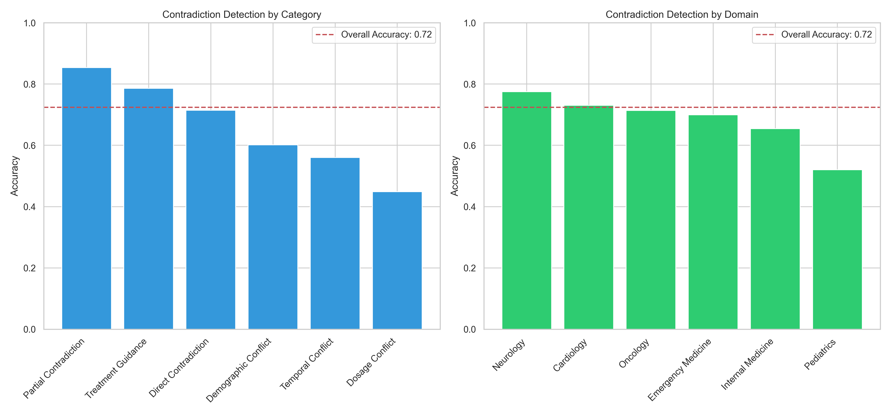
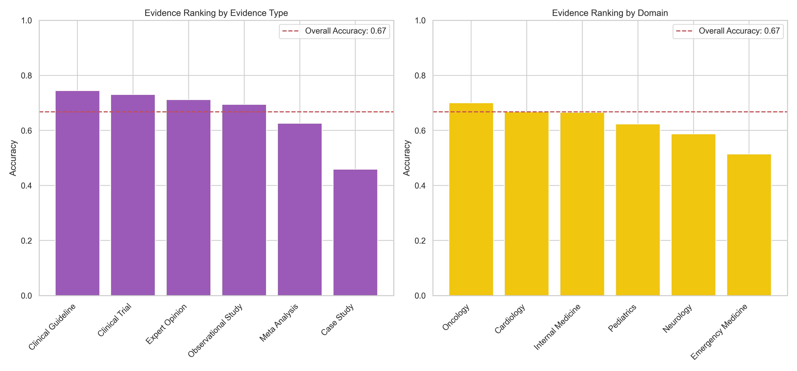
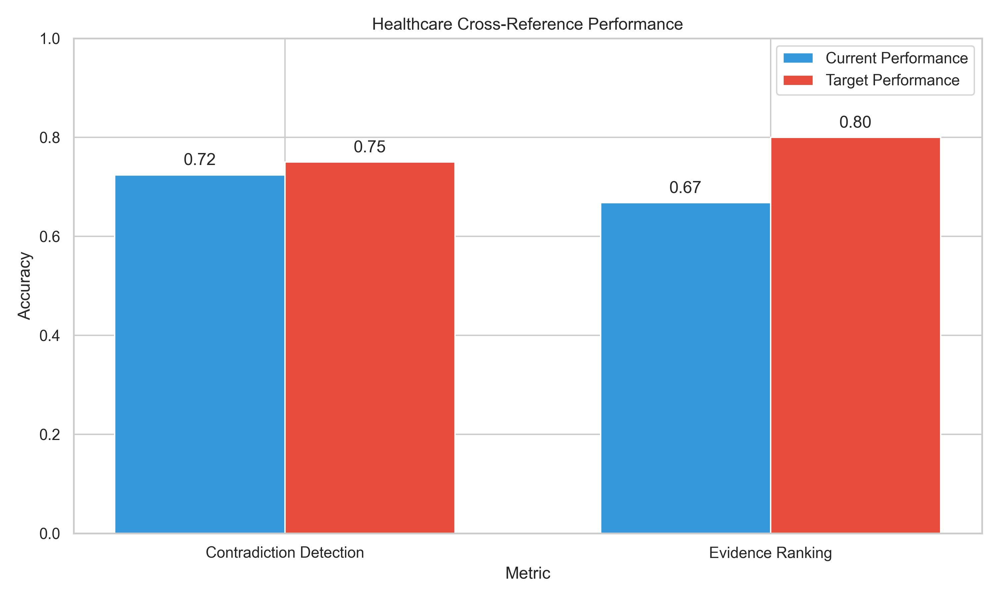

# Healthcare Cross-Reference Visualization

This document describes the visualization capabilities for healthcare cross-reference evaluation metrics.

## Overview

The healthcare cross-reference visualizations provide detailed insights into the model's performance on:

1. **Contradiction Detection:** The ability to identify conflicting medical information
2. **Evidence Ranking:** The ability to assess the relative strength of medical evidence

## Visualization Components

### Contradiction Detection Metrics



The contradiction detection visualization includes:
- Accuracy by contradiction category (direct, partial, temporal, etc.)
- Accuracy by medical domain (cardiology, oncology, etc.)
- Overall contradiction detection accuracy
- Comparison to target performance

### Evidence Ranking Metrics 



The evidence ranking visualization includes:
- Accuracy by evidence type (clinical trial, meta-analysis, etc.)
- Accuracy by medical domain
- Overall evidence ranking accuracy
- Comparison to target performance

### Combined Performance Metrics



The combined metrics visualization provides:
- Side-by-side comparison of contradiction detection and evidence ranking
- Current performance vs. target performance
- Overall assessment of healthcare cross-reference capabilities

## Usage

### Full Pipeline

To run the complete healthcare cross-reference pipeline (evaluation + visualization):

```bash
python scripts/healthcare_cross_reference_pipeline.py \
  --model <model_path> \
  --adapter <adapter_path> \
  --data <data_dir> \
  --output <output_dir> \
  --device mps
```

### Sample Data Generation

For testing visualization without running the model:

```bash
python scripts/generate_sample_healthcare_results.py \
  --output output/sample_healthcare_eval.json \
  --performance [low|medium|high]
```

### Conversion and Visualization Only

To convert existing healthcare evaluation results for visualization:

```bash
python scripts/convert_healthcare_results.py \
  --input <healthcare_results.json>
```

Then visualize the converted results:

```bash
python scripts/visualize_metrics.py \
  --results <converted_results.json> \
  --output <visualization_dir> \
  --html
```

## Key Metrics

Performance is measured across:

1. **Contradiction Detection:** 
   - Target accuracy: 0.75
   - Current benchmark gap: Variable
   
2. **Evidence Ranking:**
   - Target accuracy: 0.80
   - Current benchmark gap: Variable

3. **Categories and Domains:**
   - Contradiction categories: direct, partial, temporal, demographic, dosage, treatment
   - Evidence types: clinical trial, meta-analysis, case study, expert opinion, clinical guideline, observational
   - Medical domains: cardiology, oncology, neurology, pediatrics, emergency, internal

## Implementation Details

The visualization system is implemented across three key components:

1. `healthcare_evaluation.py`: Collects and calculates metrics
2. `convert_healthcare_results.py`: Formats results for visualization
3. `visualize_metrics.py`: Generates visual representations

All visualizations use matplotlib with accessibility considerations including:
- Colorblind-friendly palettes
- Text annotations for key values
- Clear labels and titles
